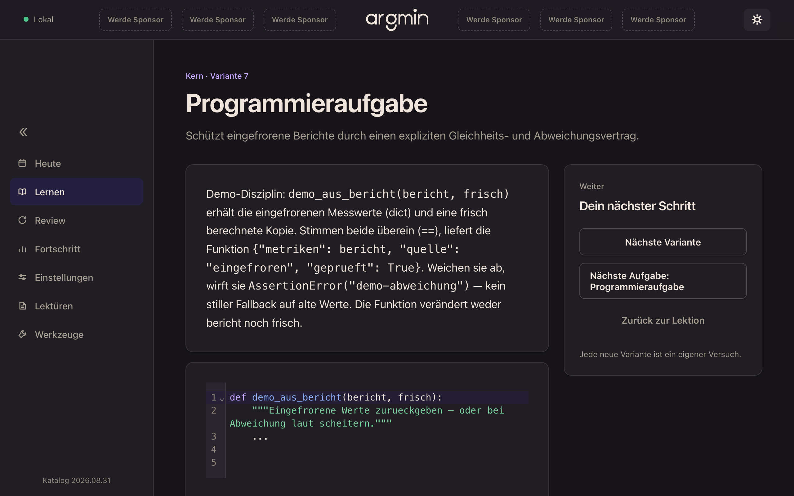
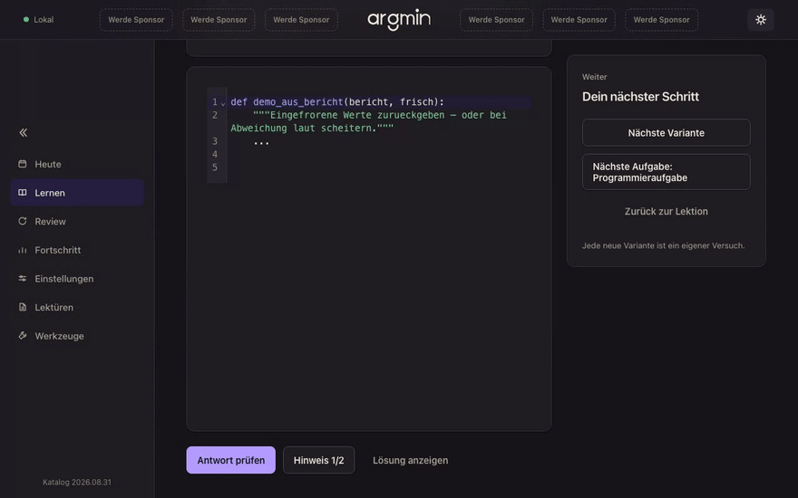

# argmin

**KI verstehen, Schritt für Schritt. Auf Deutsch, direkt im Browser. Kostenlos.**

[](https://smashburger-dev.github.io/argmin/)

argmin ist eine offene Lernplattform für alle, die verstehen wollen, wie künstliche Intelligenz wirklich funktioniert: von den Mathe-Grundlagen über Lineare Algebra und Machine Learning bis zu Deep Learning, Transformern und GenAI. Kein Vorwissen nötig. Fang von dort an, wo du jetzt gerade stehst.

Servus erstamoi! Ich bin **Noa**, auch bekannt als **no8** (keineacht auf TikTok, 8atana auf X). Ursprünglich als Privatprojekt begonnen, um als frischer Medien- & Kommunikationsbachelor und selbstständiger Creative Director einen Quereinstieg in die Welt der Künstlichen Intelligenz zu wagen. Nach etlichen Stunden an Recherche, wie man überhaupt optimal lernt, insbesondere in Bezug zur Mathematik und Coding, geschweige das Zusammenkratzen aller Ressourcen, ist mir eins aufgefallen.

**Ein gutes Stück an reichen und wertvollen Ressourcen sind auf Englisch... Und wie soll ich dann eigentlich all das üben?**

Dann habe ich mich eben dazu entschieden mit mehreren verschiedenen KI-Modellen… eine Plattform zu bauen… mit der man Künstliche Intelligenz verstehen kann… 
Ja… Schon ziemlich mutig, als Person ohne jeglichen Background in diesen Domänen, sich solch ein Projekt anzuvertrauen und zu veröffentlichen… ABER! Wenn ich eine Sache halbwegs gut kann, dann ist es die Tatsache, dass ich genau weiß, wie ich etwas angehen muss, um es zu erschaffen. Dies schulde ich meiner Selbstständigkeit in der Kreativ Branche, meiner noch frisch abgegeben Bachelor Arbeit und der Tatsache, dass es einer meiner Kern Prioritäten ist, genau diesen Quereinstieg selber erfolgreich zu schaffen. Und jetzt mal Budde bei die Fische… deswegen ist es auch **Open-Source** (haha)! Hey ich hab mein bestes gegeben, ein paar coole Features hier einzubauen!

- **Seed Generator:** Also… Jede Aufgabe auf argmin ist eigentlich eine Schablone. „Löse a·x + b = c“ zum Beispiel. Welche Zahlen da reinkommen, entscheidet eine einzige Startzahl, der Seed. Seed 42 gibt dir vielleicht 3x + 5 = 20, Seed 43 schon 7x − 2 = 12. Und weil die Lösung aus denselben Zahlen berechnet wird, passt die Prüfung immer zur Aufgabe.
- **Fortschritt, der dir gehört (also wirklich):** Kein Account, kein Server, kein Tracking. Alles liegt in deinem Browser, und du kannst es jederzeit als Datei mitnehmen.
- **Ganzes Labor im Browser-Tab:** Echtes Python mit NumPy, Formeln, interaktive Grafiken und ein Editor, der deinen Code sofort prüft.

Das heißt: Gleicher Seed, gleiche Aufgabe. Überall, auf jedem Gerät, ohne Server. Wenn dir eine Variante komisch vorkommt, sagst du einfach „Familie X, Seed 42“ und ich sehe exakt dasselbe wie du. Neuer Seed, neue Aufgabe. So oft du willst, bis es sitzt. Eine einzige Algebra-Schablone bringt es so auf 200 verschiedene Aufgaben.

## Einfach loslegen

**→ [argmin öffnen](https://smashburger-dev.github.io/argmin/)**

Das war's. Kein Account, keine Installation, keine Kosten. Dein Fortschritt bleibt in deinem Browser auf deinem Gerät — und du kannst ihn jederzeit als Datei sichern oder auf ein anderes Gerät mitnehmen.

## Was dich erwartet

- **46 Lektionen und über 250 Aufgaben** in kleinen, verständlichen Schritten. Mathe, Lineare Algebra, ML, Deep Learning, Transformer, GenAI.

[](https://smashburger-dev.github.io/argmin/)

- **Python direkt im Browser.** Du schreibst und testest echten Code, ohne irgendetwas zu installieren.
  + NumPy für Matrizen und Vektoren, sauber gesetzte Formeln (KaTeX) und interaktive Grafiken zum Anfassen (JSXGraph)… LOKAL!

  

  
- **Üben, bis es sitzt.** Viele Aufgaben erzeugen immer neue Varianten, du kannst also so oft üben, wie du willst. _Jede Aufgabe entsteht aus einem Startwert. Gleicher Startwert, gleiche Aufgabe — überall. Neuer Startwert, neue Aufgabe. So oft du willst, ohne Server._
- **Ehrliches Feedback.** Deine Antworten werden nachvollziehbar und deterministisch geprüft. Keine KI, die rät, ob du richtig liegst.
- **Ein Plan, der zu dir passt.** Wiederholungen zum richtigen Zeitpunkt und ein Wochenplan nach deinem Zeitbudget

## In Arbeit / Geplant

- Mehr Varianten: Rechenaufgaben sind schon bei 10 bis 200, viele Konzeptfragen und fast alle Coding-Aufgaben haben noch genau eine Version. Kommt Block für Block.
- Varianten für „Ablauf nachvollziehen“, Parsons und Vektor-Aufgaben (bisher fest).
- Fortschritt zwischen Geräten: heute nur per Datei-Export/Import in den Einstellungen, ein optionaler Sync ist eine Idee, kein Versprechen.

## Mitmachen

argmin lebt davon, dass Menschen mitdenken. Du musst nicht programmieren können, um zu helfen:

- Dir ist ein Tippfehler, eine unklare Erklärung oder ein Fehler aufgefallen? [Öffne ein Issue](https://github.com/smashburger-dev/argmin/issues/new) Jede Rückmeldung hilft!
- Du möchtest eine Lektion oder Aufgabe verbessern oder schreiben? In [CONTRIBUTING.md](CONTRIBUTING.md) steht, wie das geht!
- Du willst am Code mitarbeiten? Willkommen :D unten steht, wie du lokal startest.
- Mitbauen mit oder ohne KI-Agent. In WIP.md steht, was gerade offen ist: pro Punkt Ziel, betroffene Dateien, Prüfbefehle und wann es fertig ist. Damit kannst du (oder dein Agent) direkt loslegen, ohne erst das ganze Repo zu lesen.

## Hier kannst du am meisten beitragen

- Erklärungen, die noch zu technisch klingen, verständlicher machen.
- Fehler in Aufgaben melden, gern mit Familie und Seed.
- Neue Lektionen oder Aufgaben, siehe CONTRIBUTING.

## Lokal starten (für Entwickler:innen)

Du brauchst nur [Node.js 22](https://nodejs.org/). Dann:

```bash
git clone https://github.com/smashburger-dev/argmin.git
cd argmin
npm ci
npm run dev:next
```

Öffne anschließend <http://127.0.0.1:4173/> im Browser. (Bitte nicht als `file://` öffnen — die App braucht einen lokalen Server, den `npm run dev:next` für dich startet.)

**Mitbauen mit oder ohne KI-Agent.** In [WIP.md](WIP.md) steht, was gerade offen ist: pro Punkt Ziel, betroffene Dateien, Prüfbefehle und wann es fertig ist. Damit kannst du (oder dein Agent) direkt loslegen, ohne erst das ganze Repo zu lesen.

## Wie das Projekt aufgebaut ist

| Ordner | Was drin ist |
| --- | --- |
| `content/` | Alle Lerninhalte: Kompetenzen, Module, Lektionen, Aufgabenfamilien |
| `src/` | Die Oberfläche (Preact) |
| `assets/js/` | Aufgabenlogik, Prüfung der Antworten, Lernplanung |
| `schemas/` | JSON-Schemas, die die Inhalte beschreiben |
| `tests/` | Automatische Tests (Node und Browser) |
| `tools/` | Skripte zum Kompilieren, Prüfen und Bauen |
| `vendor/` | Mitgelieferte Bibliotheken (Pyodide, KaTeX, JSXGraph …) |
| `docs/` | Architektur-Entscheidungen, Autoren-Leitfaden, Lizenzen |

## Prüfen und Bauen

```bash
node --test tests/
npm run typecheck
npm run coverage:check
npm run test:e2e -- --project=chromium
npm run build:release
npm run test:e2e:build
node tools/compile_content.mjs && node tools/validate_content.mjs
node tools/validate_content.mjs --dir build-next
```

## Lizenz

Der Code steht unter MIT ([LICENSE](LICENSE)), die Lerninhalte unter CC-BY-4.0 ([LICENSE-CONTENT.md](LICENSE-CONTENT.md)). Du darfst also beides frei nutzen, teilen und weiterentwickeln.
